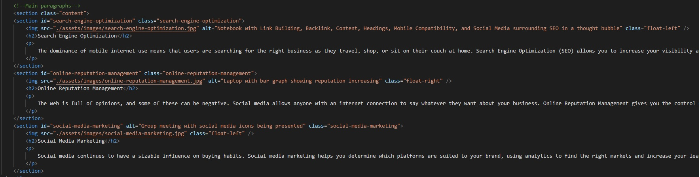

## coding-refactor

## Summary
The purpose of this assignment was to refactor a code in order for it to follow acesssibility standards.

## Steps
To refactor this code in order to meet accessibility standards, first I ensured that all possible images were given alts in order to be read by screen-readers. 

After writing the alts, I fixed the "Search Engine Optimization" link by adding an id.

Finally, I replaced all divs with sections in order to meet accessibility standards. I replaced them in both the html and css pages. 

After every change I ensured that the site still functioned as intended, so I would know where I made an error along the way. 

## Code Snippet
An example of the section tags that replaced div tags.

## Technologies used:
- [Visual Studio Code](https://code.visualstudio.com/)
- [Git](https://git-scm.com/)
- [Github](https://github.com/)
- [Google Chrome](https://www.google.com/chrome/)

## Deployed Link
* [https://alonzofroman.github.io/code-refactor/]

## Author
Alonzo Roman

## Author Links
-[Github](https://github.com/alonzofroman)
-[LinkedIn](https://www.linkedin.com/in/alonzo-roman/)

